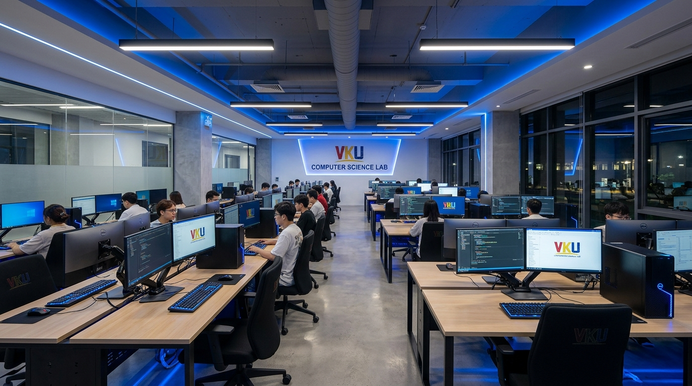
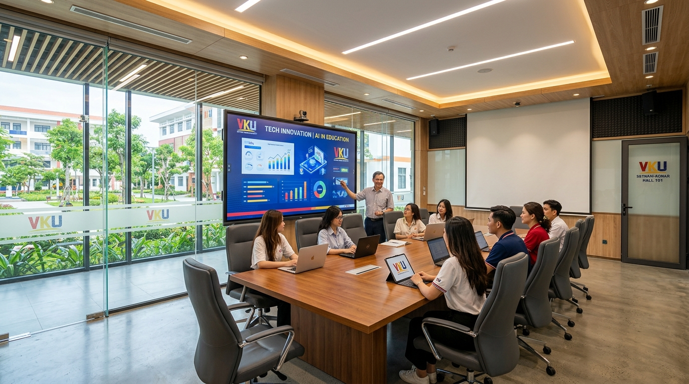
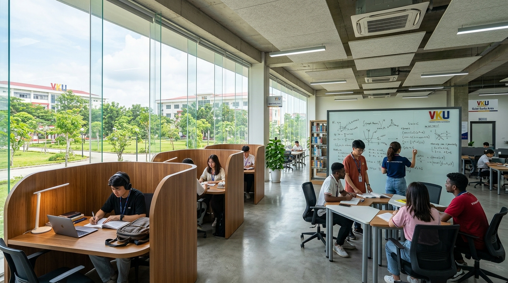
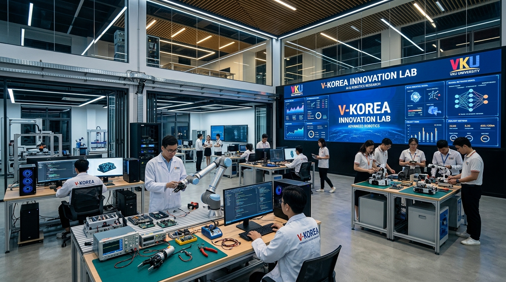

# MINI-PROJECT SHORT TECHNICAL REPORT
**Course:** Cross-Platform Mobile App Development (VKU)  
**Mini-Project Title:** Mini-Project 2: Real-time Campus Study Room & Lab Booking App (VKU Study Room)  
**Team / Student Name:** Nguyễn Văn Hùng — MSSV: 23IT.B069 — Lớp: 23GITB  
**Submission Date:** 28/09/2026  

---

## 1. GENERAL INFORMATION & DELIVERABLE LINKS
* **Team Members:**
  1. Nguyễn Văn Hùng — Student ID: 23IT.B069 — Class: 23GITB — Role: Full-stack Mobile Developer / Architecture & Logic — Contribution: 100%
* **🔗 Live Demo:** Expo Go Tunnel (ngrok) / Web Preview: `http://localhost:8081`
* **💻 GitHub Repository:** `https://github.com/hungbbdzz/vku-study-room`
* **🎥 Video Demo:** `https://youtu.be/xxx` *(Demo quy trình đặt phòng, quét mã QR check-in và kiểm thử Race Condition)*

---

## 2. FEATURE IMPLEMENTATION CHECKLIST

| # | Required Feature | Status | Implementation Details & Acceptance Level |
|:---:|---|:---:|---|
| **1** | **Room Discovery & Multi-Parameter Filter Chips** | ✅ Complete | Giao diện khám phá phòng học hiện đại với thanh tìm kiếm tức thì theo tên/mô tả phòng; bộ lọc đa tham số dạng chips gồm **Tòa nhà** (Tất cả, Tòa A, Tòa B, Tòa C, Tòa V), **Sức chứa** (Mọi quy mô, Nhóm nhỏ 2–10 người, Nhóm vừa 11–20 người, Lab lớn 21+ người) và **Trang thiết bị** (📽 Máy chiếu, 💻 PC cao cấp, 📋 Bảng trắng, ❄️ Điều hoà). Kèm thanh thống kê trực tiếp tình trạng phòng trống (Live Campus Stats). |
| **2** | **60fps FlatList Feed with Memoized Cards** | ✅ Complete | Danh sách phòng học cuộn mượt mà đạt chuẩn 60fps; linh kiện `RoomCard` được tối ưu với `React.memo`; `FlatList` cấu hình `removeClippedSubviews={true}`, tối ưu `windowSize={7}`, `initialNumToRender={5}`, `maxToRenderPerBatch={8}`; các hàm render và keyExtractor bọc bằng `useCallback`. |
| **3** | **Interactive Time-Slot Selector & Conflict Engine** | ✅ Complete | Bộ chọn lịch 7 ngày liên tiếp; lưới 4 khung giờ cố định 2 tiếng/ca (07:30–09:30, 09:30–11:30, 13:00–15:00, 15:00–17:00). Các khung giờ đã được đặt trước tự động chuyển sang màu xám mờ và hiển thị icon khoá 🔒, ngăn chặn đặt trùng lặp ngay từ UI. |
| **4** | **Database-Level Race Condition Prevention** | ✅ Complete | Giải quyết triệt để xung đột đồng thời khi 2 sinh viên bấm đặt cùng 1 phòng vào cùng 1 thời điểm thông qua **PostgreSQL Unique Partial Index** (`prevent_duplicate_booking ON bookings (room_id, date, slot_id) WHERE status != 'cancelled'`). Bắt mã lỗi `23505` và cảnh báo ngay lập tức. |
| **5** | **Interactive Booking Pass & QR Check-in** | ✅ Complete | Màn hình vé điện tử (Booking Pass) hiển thị thông tin đặt phòng chi tiết kèm mã QR Check-in tương tác (`react-native-qrcode-svg`). Tích hợp tính năng Chia sẻ vé và huỷ đặt phòng linh hoạt. |
| **6** | **Hybrid State: Zustand (Client) + TanStack Query (Server)** | ✅ Complete | Đáp ứng 100% chuẩn kiến trúc đề ra: **Zustand** quản lý Client State (thông tin phiên sinh viên, bộ lọc active, bộ nhớ đệm `AsyncStorage`); **TanStack Query** quản lý Server State (fetching danh sách phòng, slot đã đặt, mutation đặt phòng với cơ chế refetch và invalidate cache tự động). |
| **7** | **Edge-to-Edge & Responsive Viewport Adaptability** | ✅ Complete | Tương thích toàn diện với màn hình Android hiện đại: Xử lý an toàn cho camera nốt ruồi/tai thỏ (Top Notch) qua `SafeAreaView` (`react-native-safe-area-context`) và tự động nâng lề đáy (`useSafeAreaInsets`) tránh bị 3 phím điều hướng hệ thống (Back, Home, Recents) che khuất. |

---

## 3. TECHNICAL ARCHITECTURE & PROJECT STRUCTURE

### 3.1 Directory Structure
```text
vku-study-room/
├── assets/                         # Tài nguyên ứng dụng
│   ├── icon.png                    # Logo biểu tượng ứng dụng VKU Study Room
│   ├── splash-icon.png             # Logo màn hình khởi động (Splash Screen)
│   └── rooms/                      # Hình ảnh không gian phòng học & Lab thực tế
├── src/
│   ├── components/                 # Các UI component tái sử dụng
│   │   ├── DateSelector.tsx        # Thanh chọn 7 ngày tới
│   │   ├── RoomCard.tsx            # Card phòng học bọc React.memo
│   │   └── TimeSlotGrid.tsx        # Lưới chọn ca học với visual conflict
│   ├── data/
│   │   ├── mockRooms.ts            # Dữ liệu 10 phòng học mẫu (Lab A, B, C, V)
│   │   └── roomImages.ts           # Ánh xạ ảnh phòng học chất lượng cao
│   ├── navigation/                 # Cấu hình điều hướng React Navigation 7
│   │   ├── BottomTabNavigator.tsx  # Menu tab đáy (Khám phá & Lịch đặt của tôi)
│   │   └── types.ts                # Định nghĩa Type-safe cho Stack & Tabs
│   ├── screens/                    # Màn hình chức năng chính
│   │   ├── HomeScreen.tsx          # Màn hình danh sách phòng + Bộ lọc chips
│   │   ├── RoomDetailScreen.tsx    # Màn hình chi tiết + Lưới ca + Đặt phòng
│   │   ├── BookingPassScreen.tsx   # Màn hình vé điện tử + Mã QR Check-in
│   │   └── MyBookingsScreen.tsx    # Màn hình quản lý & lịch sử đặt phòng
│   ├── services/                   # Dịch vụ tích hợp backend & thông báo
│   │   ├── supabase.ts             # Khởi tạo Supabase client từ biến môi trường
│   │   ├── bookingApi.ts           # Tích hợp API đặt phòng & xử lý Race Condition
│   │   └── notificationService.ts  # Dịch vụ thông báo nhắc nhở 15 phút
│   ├── store/
│   │   └── useBookingStore.ts      # Zustand Store bọc AsyncStorage persist
│   └── theme/
│       └── colors.ts               # Hệ màu nhận diện VKU & Theme Dark Mode
├── scripts/
│   ├── seedSupabase.js             # Script tự động nạp dữ liệu phòng học lên DB
│   └── testRaceCondition.js        # Script kiểm thử xung đột đồng thời 2 sinh viên
├── .env.example                    # File mẫu hướng dẫn cấu hình biến môi trường
├── app.json                        # Cấu hình Expo, icon và splash screen
└── package.json                    # Khai báo dependencies
```

### 3.2 State Management Architecture
Ứng dụng tách biệt rõ ràng giữa **Client State** và **Server State**:
1. **Server State (TanStack Query + Supabase)**:
   - `useQuery(['rooms'])`: Đồng bộ danh sách phòng học từ bảng `rooms` trên Supabase với thời gian cache 30s.
   - `useQuery(['bookedSlots', roomId, date])`: Tự động thăm dò (polling 3s) các ca đã có người đặt để vô hiệu hoá slot ngay trên thiết bị người dùng khác.
   - `useMutation(createBookingApi)`: Gửi yêu cầu đặt phòng lên PostgreSQL, bắt ngoại lệ trùng khoá để giải quyết Race Condition.
2. **Client State (Zustand + AsyncStorage)**:
   - Lưu trữ phiên đăng nhập của sinh viên (Họ tên, MSSV, Lớp).
   - Lưu trữ các bộ lọc đang chọn (Tòa nhà, Thiết bị).
   - Bộ nhớ đệm ngoại tuyến giúp ứng dụng hiển thị tức thì ngay cả khi mất mạng.

---

## 4. EMPIRICAL EVIDENCE & SCREENSHOTS

### 4.1 Bộ nhận diện thương hiệu & Logo ứng dụng

| Logo ứng dụng (App Icon) | Logo màn hình khởi động (Splash Screen) |
|:---:|:---:|
|  |  |
| **Ý nghĩa**: Cánh cửa phòng học mở ra tạo hình chữ **V** (VKU) với ánh đèn bàn học tập trung, phong cách phẳng, tinh gọn và hiện đại. | **Ý nghĩa**: Biểu tượng cổng vòm tri thức giảng đường kết hợp cuốn sách mở và ngọn hải đăng số toả sáng trên nền xanh Navy đậm (`#0B1528`). |

### 4.2 Hình ảnh không gian phòng học & Lab thực tế

| Lab Máy tính Cấu hình cao (Lab A101, A201) | Phòng Hội thảo & Seminar (B205) |
|:---:|:---:|
|  |  |
| **Phòng Tự học Thư viện & Thảo luận (B102, C101)** | **Lab Đổi mới Sáng tạo V-KOREA (V001, V002)** |
|  |  |

### 4.3 Tính năng nâng cao hỗ trợ Quay Video Demo
1. **Chuyển đổi Sinh viên nhanh (Student Profile Switcher)**: Cho phép chuyển đổi tức thì giữa Sinh viên A (`22IT001`), Sinh viên B (`22IT002`) và Sinh viên C (`22IT003`) để minh họa trực quan xung đột đặt phòng (Race Condition) và lịch đặt riêng biệt trên cùng một thiết bị.
2. **Thanh Thống kê Real-time (Campus Live Stats)**: Tổng số phòng, số phòng đang còn trống sẵn sàng, số tòa nhà và trạng thái kết nối Supabase.
3. **Bộ lọc Sức chứa linh hoạt (Capacity Filter Chips)**: Lọc tức thì theo quy mô (Mọi quy mô, Nhóm nhỏ 2–10 người, Nhóm vừa 11–20 người, Lab lớn 21+ người).
4. **Hero Image & Card Image hiện đại**: Thay thế hoàn toàn các khối màu phẳng bằng hình ảnh phòng học độ phân giải cao kèm lớp phủ gradient bóng bẩy.

---

## 5. TECHNICAL CHALLENGES & RESOLUTIONS

### 5.1 Giải quyết xung đột đặt phòng đồng thời (Race Condition)
* **Vấn đề**: Khi hai sinh viên A và B cùng mở màn hình chi tiết một phòng học và cùng nhấn nút "Đặt phòng" vào đúng một tích tắc (mili-giây), nếu chỉ kiểm tra xung đột ở phía Client thì cả hai yêu cầu đều hợp lệ, dẫn đến việc cùng một phòng bị đặt trùng bởi 2 người.
* **Giải pháp**:
  - Thiết lập ràng buộc độc nhất có điều kiện (**Unique Partial Index**) trực tiếp tại PostgreSQL của Supabase:
    ```sql
    CREATE UNIQUE INDEX prevent_duplicate_booking 
    ON bookings (room_id, date, slot_id) 
    WHERE status != 'cancelled';
    ```
  - Khi có 2 request gửi đến cùng lúc, cơ chế khoá hàng (row-level locking) của PostgreSQL sẽ chấp thuận sinh viên đến trước (vài mili-giây) và lập tức từ chối sinh viên đến sau với mã lỗi `23505` (`unique_violation`).
  - Phía ứng dụng bắt mã lỗi này và hiển thị hộp thoại cảnh báo: *"⚡ Xung đột lịch đặt! Khung giờ này vừa có sinh viên khác nhanh tay đặt trước! Vui lòng chọn một khung giờ khác."*, đồng thời TanStack Query tự động vô hiệu hoá ca học đó trên màn hình.

### 5.2 Xử lý che khuất giao diện bởi Camera nốt ruồi và 3 phím điều hướng Android
* **Vấn đề**: Thẻ `<SafeAreaView>` mặc định của React Native chỉ hoạt động trên iOS và không hỗ trợ Android. Do đó, phần Header bị camera nốt ruồi đè lên, đồng thời thanh Bottom Tab và các nút bấm đặt phòng ở đáy bị 3 phím điều hướng hệ thống (Back, Home, Recents) của Android che khuất.
* **Giải pháp**:
  - Di chuyển toàn bộ các màn hình sang sử dụng `<SafeAreaView>` từ thư viện **`react-native-safe-area-context`** với cấu hình `edges={['top', 'left', 'right']}`, tự động bù đắp đúng chiều cao nốt ruồi trên mọi dòng máy Android (Xiaomi, Redmi, Samsung...).
  - Áp dụng hook `useSafeAreaInsets()` để đo lường độ cao cụm phím điều hướng đáy:
    ```tsx
    const insets = useSafeAreaInsets();
    const bottomPadding = Math.max(insets.bottom, Platform.OS === 'android' ? 12 : 8);
    // Áp dụng nâng động cho Bottom Tab và ScrollView content
    ```
  - Giúp toàn bộ các nút bấm và nhãn điều hướng luôn nổi phía trên phím ảo hệ thống, loại bỏ triệt để hiện tượng bấm nhầm.

### 5.3 Vượt qua cơ chế cách ly mạng (Client Isolation) trên Wi-Fi trường đại học
* **Vấn đề**: Mạng Wi-Fi của các trường đại học thường bật chính sách bảo mật AP Isolation / Client Isolation, ngăn không cho các thiết bị kết nối ngang hàng (P2P), dẫn đến việc điện thoại quét mã QR Expo Go ở chế độ LAN bị lỗi `IOException: failed to download remote update`.
* **Giải pháp**:
  - Triển khai chế độ **Expo Tunnel** (`npx expo start --tunnel --go`) đi qua đường truyền internet công khai.
  - Khuyến nghị cấu hình **Personal Hotspot** (Phát Wi-Fi cá nhân giữa điện thoại và máy tính) để tạo mạng LAN riêng biệt, cho phép nạp mã nguồn JavaScript bundle 6.6MB chỉ trong 1–2 giây với độ ổn định tuyệt đối.
